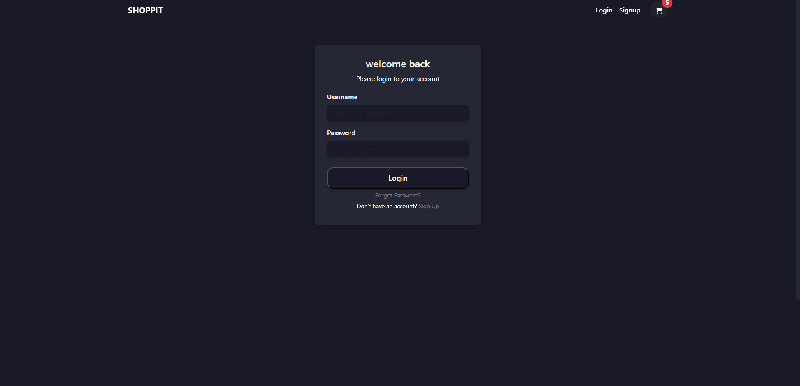
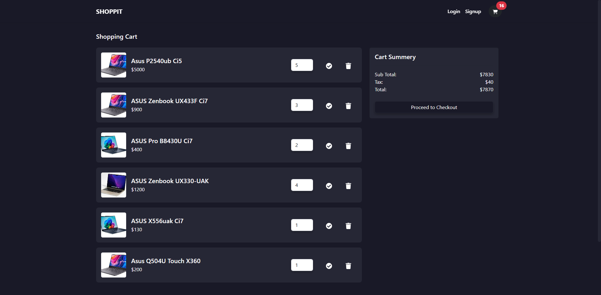
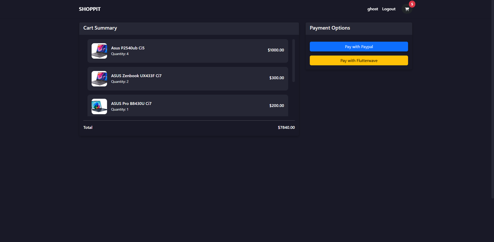

# E-Shop

## Overview
E-Shop is a modern and responsive e-commerce web application built using Django (REST API) for the backend and React with Vite for the frontend. It allows users to browse products, add them to the cart, update quantities, and proceed to checkout with payment options.

## Features
- **User Authentication**: Sign up and log in to manage your cart and purchases.
- **Product Listing**: View all available products on the home page.
- **Product Details**: Click on a product to see more details on its individual page.
- **Shopping Cart**: Add products to your cart, update quantities, and remove items.
- **Checkout Process**: View cart summary and proceed to checkout with payment options.

## Tech Stack
- **Frontend**: React, Vite, Tailwind CSS, Axios
- **Backend**: Django, Django REST Framework (DRF)
- **Database**: PostgreSQL / SQLite (depending on the environment)
- **API Calls**: Handled with Axios

## Installation
### Backend (Django + DRF)
1. Clone the repository:
   ```bash
   git clone https://github.com/your-username/eshop.git
   cd eshop
   ```
2. Set up a virtual environment:
   ```bash
   python -m venv venv
   source venv/bin/activate  # On Windows use `venv\Scripts\activate`
   ```
3. Install dependencies:
   ```bash
   pip install -r requirements.txt
   ```
4. Apply migrations and start the server:
   ```bash
   python manage.py migrate
   python manage.py runserver
   ```

### Frontend (React + Vite)
1. Navigate to the frontend directory:
   ```bash
   cd frontend
   ```
2. Install dependencies:
   ```bash
   npm install
   ```
3. Start the development server:
   ```bash
   npm run dev
   ```

### user for fast login
- username: 
   ```bash
   ghost
   ```
- password:
   ```bash
   Abc1234!
   ```

## Screenshots
### Login Page


### Home Page


### Product Page


### Cart Page


### Checkout Page


## Author
[MaryamDar](https://github.com/marydar)

